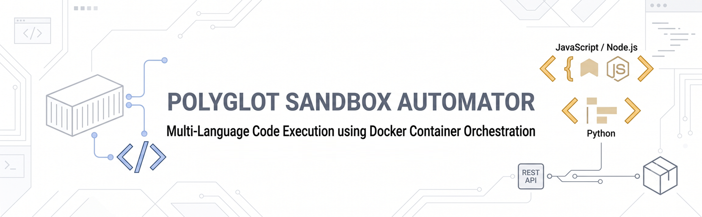
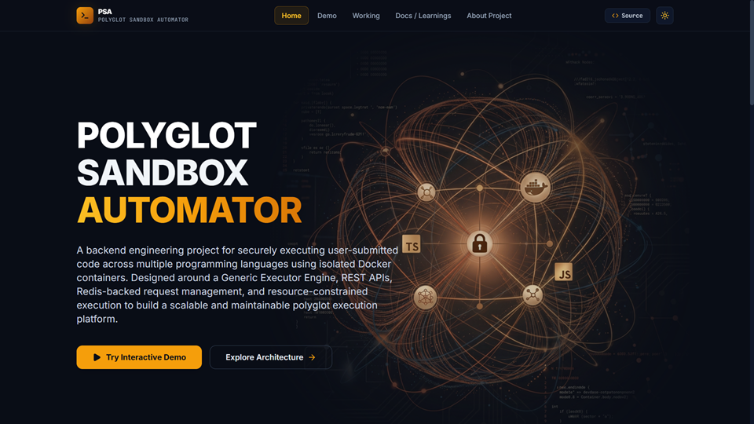
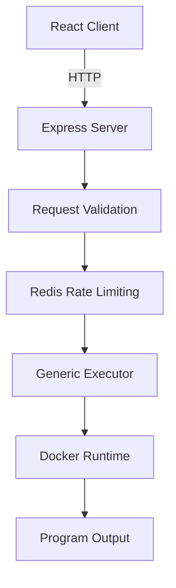

# Polyglot Sandbox Automator

<p align="center">
  
</p>

<p align="center">
  <strong>Containerized Code Execution through a Modular REST API</strong>
</p>


<p align="center">
  
  
  
  
  
  
</p>

---

<p align="center">
  
</p>

<p align="center">
  <a href="https://polyglotsandbox.vercel.app">
    
  </a>
</p>


---

## About the Project

Polyglot Sandbox Automator is a backend-focused project that securely executes user-submitted code inside isolated Docker containers through a REST API. It demonstrates modern backend engineering concepts including containerized execution, modular service design, runtime isolation, resource constraints, request validation, and Redis-backed rate limiting.

The backend is designed around a reusable execution pipeline that supports multiple programming languages through runtime configuration instead of language-specific execution logic, making the system easier to extend and maintain.

A lightweight React frontend is included to demonstrate the execution workflow, allowing users to write code, choose a supported runtime, submit execution requests, and view results in a clean interface.

---

## Objectives

The primary objectives of this project are:

* Design a secure backend capable of executing untrusted user code inside isolated Docker containers.
* Create a reusable execution pipeline that supports multiple programming languages.
* Demonstrate modular backend architecture using Node.js, TypeScript, and Express.
* Enforce execution constraints such as timeouts, memory limits, and CPU limits.
* Protect backend resources through Redis-backed rate limiting.
* Provide a simple frontend for interacting with and demonstrating the backend service.
* Build an extensible architecture that can accommodate additional programming languages and runtime environments with minimal changes.

## Features

### Secure Containerized Execution

Every execution request runs inside an isolated Docker container, preventing user programs from executing directly on the host system.

### Generic Execution Pipeline

A reusable execution engine manages the complete execution workflow, allowing multiple programming languages to share the same backend logic through runtime-specific configuration.

### Multi-Language Support

Currently supported runtimes:

* Python 3.11
* Node.js 20

The architecture is designed to simplify the addition of new language runtimes.

### REST API

A clean RESTful API exposes the execution service, making it easy to integrate with web applications or other clients.

### Resource Constraints

Each execution is performed under configurable resource limits, including:

* Execution timeout
* Memory limits
* CPU allocation
* Automatic container cleanup

### Redis-Based Rate Limiting

Redis is used to limit execution requests and protect backend resources from excessive usage.

### Automatic Cleanup

Temporary source files and execution containers are removed after every execution to maintain a clean runtime environment.

### Modular Architecture

The backend is organized into independent modules for routing, middleware, execution, configuration, and utilities, improving maintainability and scalability.

### Interactive Frontend

A React-based frontend provides an interface for writing code, selecting a runtime, executing programs, and viewing results.

---

## Technology Stack

| Category                | Technologies                             |
| ----------------------- | ---------------------------------------- |
| **Backend**             | Node.js, TypeScript, Express.js          |
| **Frontend**            | React, Vite, Tailwind CSS, Monaco Editor |
| **Containerization**    | Docker, Docker Compose                   |
| **Data Store**          | Redis                                    |
| **Development Tools**   | Git, GitHub, npm                         |
| **Languages Supported** | Python 3.11, Node.js 20                  |

---

## Architecture Overview

The application follows a modular client-server architecture where execution requests pass through validation, rate limiting, and a generic execution pipeline before being executed inside isolated Docker containers.

<p align="center">
  
</p>

### High-Level Flow


---

## Project Structure
```text
polyglot-sandbox-automator/
│
├── containers/
│   ├── node/
│   └── python/
│
├── docs/
│   └── images/
|
├── frontend/
│   ├── src/
│   ├── public/
│   ├── package.json
│   └── vite.config.ts
│
├── src/
│   └── Executor.ts
│   └── rateLimiter.ts
│   └── redis.ts
│   └── server.ts
│
├── workspace/                                                                  
│
├── package.json
├── docker-compose.yml
└── README.md
```

### Repository Layout

| Directory   | Description                                             |
| ----------- | ------------------------------------------------------- |
| `backend/`  | Express API, execution engine, middleware, and services |
| `frontend/` | React application for interacting with the backend      |
| `docker/`   | Runtime images for supported programming languages      |
| `docs/`     | Images and supporting documentation assets              |
